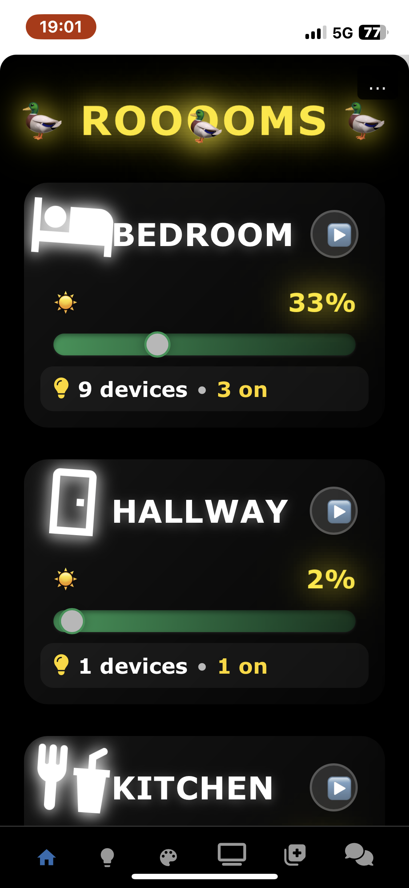
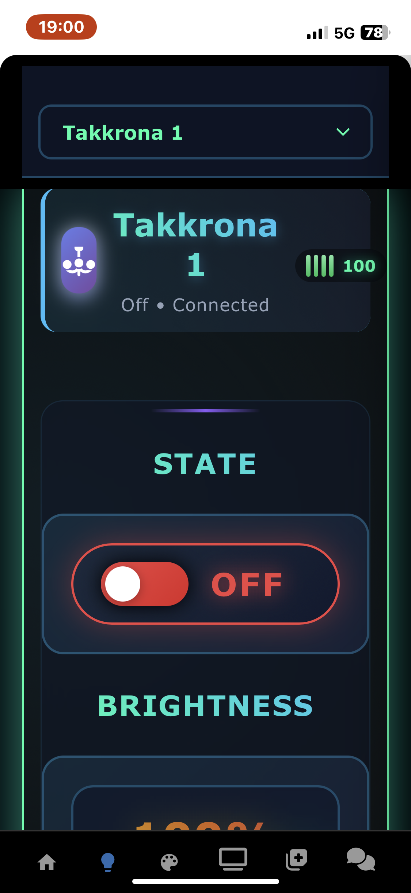
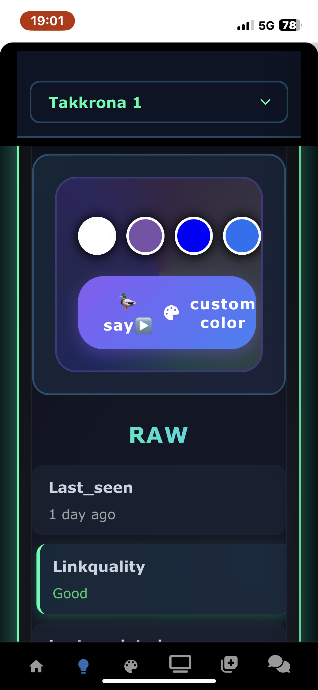
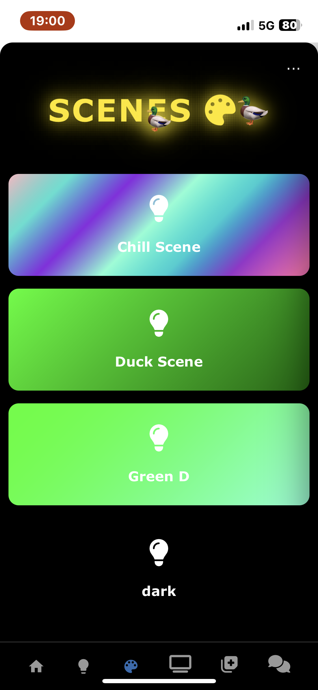

# **Zigduck2mqttnix**

[ "")](https://github.com/sponsors/QuackHack-McBlindy) [](https://buymeacoffee.com/quackhackmcblindy)


<br>

Declarative full-stack Zigbee home automation system that's reproducible and deployable.  
Nix for configuration, Rust for responsive async runtime.  
Under the hood: zigbee2mqtt, Mosquitto, serde_json and adb.   
  
Define once, forget forever.   

Zigduck2mqttnix uses smart defaults, after defining your rooms & devices -- most users don’t need to write any automations at all.  
  
An optional dashboard page is generated from the defined Nix configuration to display customized cards as well as scene activation and device control on-the-fly.   
 

```markdown
            Nix
             │
             ▼
        zigduck-rs
             │
      ┌──────┴──────┐
      ▼             ▼
    MQTT         REST API
      │             │
      ▼             ▼
 zigbee2mqtt    adb/media
      │             │
      └──────┬──────┘
             ▼
          Devices
```

<br>

Want to top it off with declarative voice control? See [yo](https://github.com/QuackHack-McBlindy/yo).   
See [DOCS](https://github.com/QuackHack-McBlindy/Zigduck2mqttnix/blob/main/DOCS.md) for more text.  

<br> 
 
 
## **Installation**

<details><summary><strong>
❄️ Using flakes
</strong></summary>

Use `Zigduck2mqttnix`:  
  

#### **1: Add zigduck2mqttnix as an input in your flake.nix**

```nix
  inputs = {
    nixpkgs.url = "github:NixOS/nixpkgs/nixos-unstable";
    zigduck2mqttnix.url = "github:quackhack-mcblindy/zigduck2mqttnix";
  };
```


#### **2: Import the zigduck2mqttnix module into your configuration**  
  

```nix
  imports = [ zigduck2mqttnix.nixosModules.zigduck2mqttnix ];
```


#### **3: Enable the services**  

```nix
    environment.systemPackages = [ 
      self.inputs.zigduck2mqttnix.packages.x86_64-linux.zigduck-rs
      self.inputs.zigduck2mqttnix.packages.x86_64-linux.zigduck-cli
      self.inputs.zigduck2mqttnix.packages.x86_64-linux.zigduck-api
    ];
    services.zigduck = {
      enable = true;
      api.enable = true;
      api.port = 13335;
      api.passwordFile = config.sops.secrets.api.path;
      dashboard.enable = true;
      dashboard.port = 13336;
      dashboard.passwordFile = config.sops.secrets.dashboard.path;
      broker = "192.168.1.110";
      cli.broker = "192.168.1.110";      
      extraEnv.PATH = 
        "/run/current-system/sw/bin:"
        + "/optional/wrappers";
      };              
    };

};
```


</details>

<br>

## **Configuration**


<details><summary><strong>
Zigbee configuration
</strong></summary>

**Example configuration:**

```nix
  house = {
    zigbee = {
      # without this network key there is no reproducibility
      networkKeyFile = config.sops.secrets.z2m_network_key.path;
      mosquitto = {
        host = "192.168.1.110";
        username = "duckmqtt";
        passwordFile = config.sops.secrets.mosquitto.path;
      };
      coordinator = {
        vendorId =  "10c3";
        productId = "ea61";
        symlink = "zigbee"; # device symlink
      };
      # optional philips hue  bridge etc
      hueSyncBox = { 
        enable = true;
        bridge = { 
          ip = "192.168.1.33";
          # api token:
          # curl -X POST http://192.168.1.33/api -d '{"devicetype":"house#nixos"}'
          passwordFile = config.sops.secrets.hueBridgeAPI.path;
        }; 
        syncBox = {
          ip = "192.168.1.34";
          passwordFile = config.sops.secrets.hueBridgeAPI.path;
          tv = "shield";
        };
      }; 
    };
```     

<br>
</details>

<details><summary><strong>
Rooms
</strong></summary>

**Example configuration:**

```nix
  house = {
    rooms = {
      bedroom.icon    = "mdi:bed";
      hallway.icon    = "mdi:door";
      kitchen.icon    = "mdi:food-fork-drink";
      livingroom.icon = "mdi:sofa";
      wc.icon         = "mdi:toilet";
      tv-area.icon    = "mdi:television";
      other.icon      = "mdi:misc";
    };
```

</details>

<details><summary><strong>
Lights /  Devices 
</strong></summary>

  
zigduck2mqttnix always uses smart defaults.   
Define a dimmer, or motion sensor it'those devices would default to control that room, unless overidden.     

**Example configuration:**  

```nix
  house = {
    zigbee = { 
      devices = {
        "0x0016830103ba7e95" = { # 64bit IEEE address (this is the unique device ID)  
          friendly_name = "Dimmer Switch Kitchen"; # simple human readable friendly name
          room = "kitchen"; # bind to group
          type = "dimmer"; # device type
          endpoint = 1; # zigbee endpoint
          batteryType = "CR2450"; # optional
        }; 
        "0x0017880402750848a" = { 
          friendly_name = "Spotlight kök 1";
          room = "kitchen";
          type = "light";
          endpoint = 11;
        };
      };
    };  
```
      
<br>

</details>


<details><summary><strong>
Dimmers /  Motion 
</strong></summary>

**Example configuraiton:**  

```nix    
    zigbee
      dimmer = {
        message = "action";
        doubleClickTimeout = 500;
        # optional as these defaults match most dimmers
        #actions = {
        #  onPress = "on_press_release";
        #  onHold = "on_hold_release";
        #};  
      };
      
      motion = {
        enable = true;
        trigger.lights = {
          after = 14;
          before = 9;
          duration = 900;
        };  
      };
```

<br>

</details>

<details><summary><strong>
Scenes
</strong></summary>


**Example configuraiton:**  

```nix
  house.zigbee = {
    scenes = {
      "Scene name" = {
        # device friendly_name
        "Spotlight kök 1" = {
          state = "ON";
          brightness = 200;
          color = { hex = "#00FF00"; };
        };
        # ... more lights
```

<br>

</details>


<details><summary><strong>
Automations
</strong></summary>

**Example configuraiton:**  

```nix
  house = {
    zigbee = {   
      # there are 6 different automation types    
      automations = {  
        # + a greeting automation
        greeting = {
          enable = true;
          awayDuration = 7200;
          delay = 10;
          actions = [
            {
              type = "shell";
              command = ''
                tts "greeting message" 
              '';
            }
          ];
        };
        

        # 1. MQTT triggered automations
        mqtt_triggered = {
          alarm_wakeup = {
            enable = true;
            description = "Time to wake up!";
            topic = "zigbee2mqtt/alarm/triggered";
            actions = [  
              # there are 4 different automation action types
              # 1. shell
              { type = "shell"; command = "tv --typ youtube --search 'nisse snus'"; }     
              # 2. scene
              { type = "scene"; scene = "max"; }
              # 3. mqtt
              { type = "mqtt"; topic = "zigbee2mqtt/Robot Arm 3/set"; message = ''{"state":"OFF"}''; }
              { type = "mqtt"; topic = "zigbee2mqtt/Robot Arm 4/set"; message = ''{"state":"OFF"}''; }
              # 4. wait
              { type = "wait"; duration = 10; }
              { type = "scene"; scene = "dark-fast"; }
              { type = "wait"; duration = 2; }
              { type = "shell"; command = "curl http://192.168.1.13/api/settings/speaker/play/ding"; }              
              { type = "scene"; scene = "max"; }
              { type = "wait"; duration = 2; }     
              { type = "shell"; command = "curl http://192.168.1.15/api/settings/speaker/play/ding"; }          
              { type = "wait"; duration = 10; }
              { type = "mqtt"; topic = "zigbee2mqtt/Roller Shade/set"; message = ''{"state":"ON"}''; }
            ];
          };

          timer_finish = {
            enable = true;
            description = "an timer is ringing";
            topic = "zigbee2mqtt/timer/finished"; 
            actions = [
              { type = "scene"; scene = "max"; }
              { type = "shell"; command = "curl http://192.168.1.15/api/settings/speaker/play/ding"; }
              { type = "wait"; duration = 7; }
              { type = "scene"; scene = "dark-fast"; }
              { type = "wait"; duration = 2; }
              { type = "scene"; scene = "max"; }              
            ];
          };
        };
          
        # 2. room action automations
        room_actions = {
          hallway = { 
            # sinple string can be used as "shell" automation action
            door_opened = ["curl http://192.168.1.15/api/settings/speaker/play/ding";];
            door_closed = [];
          };
          
          kitchen = { 
            motion_not_detected = [
              {
                type = "mqtt";
                topic = "zigduck/topic/subtopic";
                message = "my mqtt message";
              }
              {
                type = "scene";
                scene = "kitchenFadeOff";
              }
            ];  

            motion_detected = [
              { 
                type = "scene";
                scene = "kitchenInstant";
              }
            ];
          };
        };
          
        # 3. global actions automations  
        global_actions = {
          leak_detected = [
            {
              type = "shell";
              command = "yo notify '🚨 WATER LEAK DETECTED!'";
            }
          ];
          smoke_detected = [
            {
              type = "shell";
              command = "yo notify '🔥 SMOKE DETECTED!'";
            }
          ];
        };

        # 4. [optional] dimmer actions automations (default configured per room)
        dimmer_actions = {          
          bedroom = {
            off_hold_release = {
              enable = true;
              description = "Turn off all configured light devices";
              extra_actions = [];
              override_actions = [
                {
                  type = "scene";
                  scene = "dark";
                }
                {
                  type = "mqtt";
                  topic = "zigbee2mqtt/Fläkt/set";
                  message = ''{"state":"OFF"}'';
                }
              ];
            };   
          };              
        };
        
        # 5. time based automations
        time_based = {       
          morning_wakeup = {
            enable = true;
            description = "set morning wakeup alarm (dont miss lunch)";
            # 01 AM mon-fri 
            schedule = {
              start = "01:00";
              days = ["mon" "tue" "wed" "thu" "fri"];
            };
            conditions = [ { type = "someone_home"; value = true; } ];
            # 11 AM (i like to sleep in)
            actions = [ "zigduck-cli alarm add --hours 11 --minutes 00" ];
          };
        };
 
        
        # 6. presence based automations
        presence_based = {};        
      };  

```

<br>

</details>


<details><summary><strong>
Media (optional)
</strong></summary>

**Example configuraiton:**  

```nix
  house = {
    # path to a file containing user 's HTTPS URL.
    # example file contents: https://media.my-domain.org
    https.urlFile = config.sops.secrets.webserver.path;
    # root directory for the media library.
    # the URL above should point to this service.
    # no external port needs to be exposed as long as the TLS certificate remains valid.
    media.root = "/Pool";
    
    # YouTube API token
    media.youtubePasswordFile = config.sops.secrets.youtubeAPI.path;
        
    # media type directories
    media = {
      movies = "/Pool/Movies";
      tv = "/Pool/TV"; 
      music = "/Pool/Music"; 
      musicVideos = "/Pool/Music_Videos";
      otherVideos = "/Pool/Other_Videos"; 
      podcasts = "/Pool/Podcasts";
    };


    # tv's    
    tv = {
      "my-tv" = {
        ip = "192.168.1.123";
        room = "bedroom";
      };    
    };    
  };
```

<br>

</details>


<details><summary><strong>
Dashboard (optional) 
</strong></summary>

<br>

<a href="https://github.com/QuackHack-McBlindy/Zigduck2mqttnix/blob/main/images/IMG_3316.png">
  
</a>

<a href="https://github.com/QuackHack-McBlindy/Zigduck2mqttnix/blob/main/images/IMG_3314.png">
  
</a> 

<a href="https://github.com/QuackHack-McBlindy/Zigduck2mqttnix/blob/main/images/IMG_3315.png">
  
</a> 

<a href="https://github.com/QuackHack-McBlindy/Zigduck2mqttnix/blob/main/images/IMG_3313.png">
  
</a> <br> <br>


**Example optional configuraiton:**  


```
  house = {
    zigbee.automations = {
      mqtt_triggered = {    
        temperature_update = {
          enable = true;
          description = "Update living room temperature on the dashboard";
          topic = "zigbee2mqtt/Living Room Sensor";
          actions = [
            {
              type = "shell";
              command = ''
                # Read the MQTT payload, extract the "temperature" field,
                # and write it to /var/lib/zigduck/temperature.json with a history array.
                VALUE=$(echo "$MQTT_PAYLOAD" | jq '.temperature')
                FILE="/var/lib/zigduck/temperature.json"
                mkdir -p "$(dirname "$FILE")"

                if [ ! -s "$FILE" ]; then
                  jq -n --argjson v "$VALUE" '{ temperature: $v, history: [$v] }' > "$FILE"
                else
                  jq --argjson v "$VALUE" '
                    .temperature = $v |
                    .history += [$v] |
                    .history = (.history[-200:])
                  ' "$FILE" > "$FILE.tmp" && mv "$FILE.tmp" "$FILE"
                fi
              '';
            }
          ];
        };
      };  
    };   
    
    dashboard = {
      # optional status cards
      statusCards = {    
        temperature = {
          enable = true;
          title = "TEMPERATURE C";
          group = "sensors";
          icon = "fas fa-thermometer-half";
          color = "#e74c3c";
          theme = "glass";
          filePath = "/var/lib/zigduck/temperature.json";          
          jsonField = "temperature";
          format = "{value} °C";
          detailsFormat = "Temperature in Hallway";
          chart = true;
          historyField = "history";
        };         
      };
      
      # optional extra custom dashboard pages
      pages = {    
        "3" = {
          icon = "fas fa-television";
          title = "remote";
          # symlink optional files/directories to webserver
          files = { tv = "/var/lib/zigduck/tv"; };
          css = # css code
          code = # html code
        };  
    };  
```


</details>

<details><summary><strong>
Commandline 
</strong></summary>

**Zigduck-CLI**  


```
Usage: zigduck-cli [OPTIONS] [COMMAND]

Commands:
  timer  
  alarm  
  help   Print this message or the help of the given subcommand(s)

Options:
  -b, --broker <BROKER>
          MQTT broker host [env: MQTT_BROKER=] [default: 127.0.0.1]
  -u, --user <USER>
          MQTT username [env: MQTT_USER=] [default: mqtt]
      --password-file <PASSWORD_FILE>
          MQTT password file [env: MQTT_PASSWORD_FILE=]
      --password <PASSWORD>
          MQTT password [env: MQTT_PASSWORD=]
  -v, --verbose...
          Verbosity level
      --devices-config <DEVICES_CONFIG>
          Path to devices configuration [env: DEVICES_CONFIG=]
      --scenes-config <SCENES_CONFIG>
          Path to scenes configuration [env: SCENES_CONFIG=]
      --hue-bridge-ip <HUE_BRIDGE_IP>
          Hue Bridge IP [env: HUE_BRIDGE_IP=]
      --hue-api-key <HUE_API_KEY>
          Hue Bridge API key [env: HUE_API_KEY=]
      --hue-key-file <HUE_KEY_FILE>
          Hue Bridge API key file [env: HUE_KEY_FILE=]
      --device <DEVICE>
          Device name (friendly name)
      --room <ROOM>
          Room name
      --scene <SCENE>
          Scene name
      --list [<LIST>]
          List devices, rooms, scenes, lights, or sensors [possible values: devices, rooms, scenes, lights, sensors]
      --status
          Show a formatted device status table including state, battery, temperature
      --state-file <STATE_FILE>
          Path to local state.json (overrides API fetch) [env: ZIGDUCK_STATE_FILE=]
      --pair [<PAIR>]
          Pairing duration in seconds (default: 120)
      --all-lights [<ALL_LIGHTS>]
          Control all lights (optional true/false)
      --cheap-mode <CHEAP_MODE>
          Room name for cheap mode
      --json-cmd
          Send raw JSON to a device
      --state <STATE>
          Device state: on/off/toggle/max/dark
      --brightness <BRIGHTNESS>
          Brightness percentage (1-100)
      --color <COLOR>
          Color name or hex code
      --temperature <TEMPERATURE>
          Color temperature (153-500)
      --transition <TRANSITION>
          Transition time in seconds
      --payload <PAYLOAD>
          Raw JSON payload
      --backend <BACKEND>
          Backend type (auto/zigbee/hue) [default: auto] [possible values: auto, zigbee, hue]
      --json-output
          Output list as JSON
      --watch
          Watch for new devices during pairing
      --random
          Pick a random scene
      --scene-room <SCENE_ROOM>
          Restrict scene to a specific room
      --delay <DELAY>
          Delay in seconds for cheap mode [default: 300]
      --api-url <API_URL>
          zigduck API URL [env: API_URL=]
      --api-password-file <API_PASSWORD_FILE>
          File containing API password [env: API_PASSWORD_FILE=]
      --api-password <API_PASSWORD>
          API password directly [env: API_PASSWORD=]
  -h, --help
          Print help (see more with '--help')
  -V, --version
          Print version

```

<br>


**Android tvOS controller**  

**tv:**  

```
Cast media to an Android TV device via ADB

Usage: tv [OPTIONS] --typ <TYP>

Options:
  -t, --typ <TYP>              [possible values: on, off, up, down, next, prev, pause, play, call, youtube, tv, movie, podcast, music, musicvideo, audiobook, jukebox, song, othervideo]
  -s, --search <SEARCH>        
      --season <SEASON>        
      --room <ROOM>            
      --ip <IP>                
      --no-shuffle             
      --max-items <MAX_ITEMS>  
      --config <CONFIG>        [default: /etc/zigduck/tv-defaults.json]
  -h, --help                   Print help

```


<br>

</details>


<details><summary><strong>
API
</strong></summary>


**Endpoints:**  


| Endpoint | Method | Description | Parameters | Auth Required |
|----------|--------|-------------|------------|---------------|
| `/` | GET | Service info and list of all endpoints | None | Yes |
| `/transcode-video`<br>`/api/transcode-video` | GET | Streams transcoded video from a given URL (MP4, chunked transfer) | `url` (URL to transcode) | Yes |
| `/browse`<br>`/browsev2`<br>`/api/browse`<br>`/api/browsev2` | GET | Browse media directory (legacy `ls` or improved `find`). `browsev2` returns full path. | `path` (relative to media root) | Yes |
| **Timers** | | | | |
| `/timers` | GET | List all timers | None | Yes |
| `/timers/set` | GET | Create a new timer | `hours`, `minutes`, `seconds` (at least one >0), `topic`, `payload`, optional `name` | Yes |
| `/timers/pause` | GET | Pause a running timer | `id` (timer ID) | Yes |
| `/timers/resume` | GET | Resume a paused timer | `id` | Yes |
| `/timers/cancel` | GET | Cancel (delete) a timer | `id` | Yes |
| **Alarms** | | | | |
| `/alarms`<br>`/api/alarms` | GET | List all alarms | None | Yes |
| `/alarms/add`<br>`/api/alarms/add` | GET | Add a new alarm | `hours` (0-23), `minutes` (0-59), `name`, optional `days` (comma-separated 0=Sun..6=Sat) | Yes |
| `/alarms/remove`<br>`/api/alarms/remove` | GET | Remove an alarm | `id` | Yes |
| `/alarms/toggle`<br>`/api/alarms/toggle` | GET | Toggle alarm on/off | `id` | Yes |
| **Media (ADB)** | | | | |
| `/media/power/on`<br>`/api/media/power/on` | GET | Wake up media device | `device` (IP, default `192.168.1.224`) | Yes |
| `/media/power/off`<br>`/api/media/power/off` | GET | Sleep media device | `device` | Yes |
| `/media/next` | GET | Next track | `device` | Yes |
| `/media/previous` | GET | Previous track | `device` | Yes |
| `/media/play`<br>`/media/pause` | GET | Toggle play/pause | `device` | Yes |
| `/media/volume/up` | GET | Volume up | `device` | Yes |
| `/media/volume/down` | GET | Volume down | `device` | Yes |
| `/media/playlist` | GET | Launch playlist on device (ADB intent) | `device`, optional `url` (defaults to webserver `/playlist.m3u`) | Yes |
| **Playlist (m3u file)** | | | | |
| `/playlist/list` | GET | List current m3u playlist | None | Yes |
| `/playlist/add` | GET | Add entry to playlist | `entry` (path) | Yes |
| `/playlist/remove` | GET | Remove entry by index (0-based) | `index` | Yes |
| `/playlist/shuffle` | GET | Shuffle playlist | None | Yes |
| `/playlist/clear` | GET | Clear entire playlist | None | Yes |
| **Health** (no auth) | | | | |
| `/health`<br>`/api/health` | GET | Basic health check | None | No |
| `/health/all`<br>`/api/health/all` | GET | Aggregate health from all services | None | No |
| **State** | | | | |
| `/state`<br>`/api/state` | GET | Full state of all Zigbee devices | None | Yes |
| `/state/{device}`<br>`/api/state/{device}` | GET | State of a specific device | `{device}` (friendly name) | Yes |
| `/state/room/{room}`<br>`/api/state/room/{room}` | GET | State of all devices in a room | `{room}` | Yes |
| **Devices & Scenes** | | | | |
| `/device/list`<br>`/api/device/list` | GET | List all devices (from `devices.json`) | None | Yes |
| `/device/{device}/{command}/{value}...` | GET | Control a device (multiple commands can be chained) | `{device}` name, then pairs like `state/on`, `brightness/200`, `color/%23FF5733`, `temperature/300` | Yes |
| `/device/rooms`<br>`/api/device/rooms` | GET | List devices grouped by room | None | Yes |
| `/device/types`<br>`/api/device/types` | GET | List devices grouped by type | None | Yes |
| `/scene/{scene}`<br>`/api/scene/{scene}` | GET | Activate a scene | `{scene}` (scene name) | Yes |
| **Utilities** | | | | |
| `/tts` | GET | Text‑to‑speech, returns audio/wav | `text` | Yes |
| `/do`<br>`/api/do` | GET | Natural language command (e.g., `?cmd=do turn on kitchen light`) | `cmd` | Yes |
| `/upload`<br>`/api/upload` | POST | File upload (multipart/form‑data) to `/var/lib/zigduck/uploads` | File data in body | Yes |


<br>

</details>

<br>


<details><summary><strong>
Inspiration?
</strong></summary>

<br>

for a full configuration example view:  
*[my home](https://github.com/QuackHack-McBlindy/dotfiles/blob/main/modules/myHouse.nix)*

<br>

</details>

<br>

## **License**

This project is licensed under the terms of the MIT license.  
See the `LICENSE` file in the repository for full details.

Contributions are welcomed.


